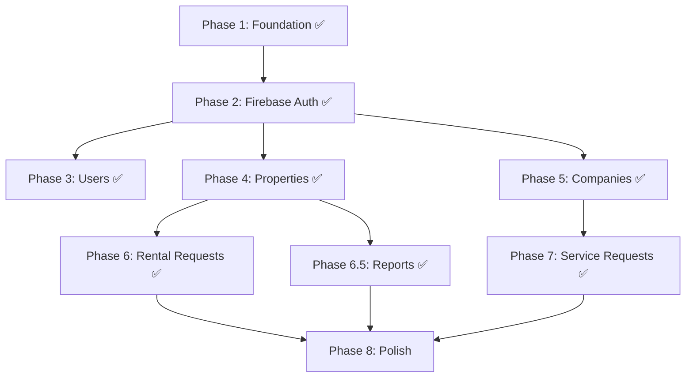

# RentX Backend — Implementation Plan (Firebase Auth)

Everything below is derived from [system_architecture.md](file:///d:/Zabir/IIUC/6th%20Sem/Final/SD/Project/rentx/system_architecture.md), updated to use **Firebase Authentication** and refined with real business logic decisions made during development.

> [!IMPORTANT]
> **Auth flow:** Frontend handles registration/login via Firebase Auth SDK → gets a Firebase ID token → sends it in `Authorization: Bearer <token>` header → backend verifies it with `firebase-admin` and maps the Firebase UID to a MongoDB User document. If backend validation fails, the Firebase account is automatically rolled back (deleted).

---

## Phase 1 — Foundation & Utilities ✅

> **Goal:** Set up the scaffolding that every future file depends on.

| # | Task | Status |
|---|------|--------|
| 1.1 | `config/env.js` — centralize env var loading & validation | ✅ |
| 1.2 | `utils/asyncHandler.js` — wrapper to eliminate try/catch | ✅ |
| 1.3 | `middleware/errorMiddleware.js` — central error handler | ✅ |
| 1.4 | Install `firebase-admin` dependency | ✅ |
| 1.5 | Update `server.js` — use `config/env.js`, wire up error middleware | ✅ |

---

## Phase 2 — Firebase Auth Integration ✅

> **Goal:** Verify Firebase tokens on the backend, sync Firebase users to MongoDB.

| # | Task | Status |
|---|------|--------|
| 2.1 | `config/firebase.js` — initialize `firebase-admin` via env vars | ✅ |
| 2.2 | `middleware/authMiddleware.js` — `protect` (mandatory auth) + `protectOptional` (identifies user if token present) | ✅ |
| 2.3 | `middleware/roleMiddleware.js` — restrict to specific roles | ✅ |
| 2.4 | `controllers/authController.js` — `syncUser` with Firebase rollback on validation failure | ✅ |
| 2.5 | `routes/authRoutes.js` — `POST /api/auth/sync` | ✅ |

**Key decisions:**
- Firebase credentials stored in `.env` (not a JSON file)
- If MongoDB validation fails during sync, the Firebase account is automatically deleted (rollback) to prevent "ghost accounts"
- Registration validates: BD phone (01XXXXXXXXX), allowed roles only (tenant/owner/company — never admin), required address field

---

## Phase 3 — User Management ✅

| # | Task | Status |
|---|------|--------|
| 3.1 | `controllers/userController.js` — getUsers (admin), getUserById (self/admin), updateUser (self/admin) | ✅ |
| 3.2 | Refactored `routes/userRoutes.js` — proper middleware | ✅ |

---

## Phase 4 — Property Listings (CRUD) ✅

| # | Task | Status |
|---|------|--------|
| 4.1 | `controllers/propertyController.js` — full CRUD with category validation | ✅ |
| 4.2 | `routes/propertyRoutes.js` — proper middleware per endpoint | ✅ |
| 4.3 | Mounted in `server.js` | ✅ |

**Key decisions:**
- `storey` and `elevator` are required fields in the schema
- Category strictly validated against allowed enum values
- `isAvailable: false` properties are invisible to tenants/public (hardcoded filter, not bypassable via query params)
- `protectOptional` used on single-property view to allow owner/admin to see their own unavailable listings
- `showPhone` boolean — owner chooses whether their phone appears in listing; controller strips phone from populated owner data for public viewers

---

## Phase 5 — Company Profiles ✅

| # | Task | Status |
|---|------|--------|
| 5.1 | `models/companyProfileModel.js` | ✅ |
| 5.2 | `controllers/companyController.js` — with duplicate profile prevention | ✅ |
| 5.3 | `routes/companyRoutes.js` | ✅ |
| 5.4 | Mounted in `server.js` | ✅ |

---

## Phase 6 — Rental Requests ✅

> **Goal:** Tenants request to rent a property; owners approve/reject.

| # | Task | Status |
|---|------|--------|
| 6.1 | `models/rentalRequestModel.js` | ✅ |
| 6.2 | `controllers/rentalRequestController.js` | ✅ |
| 6.3 | `routes/rentalRequestRoutes.js` | ✅ |
| 6.4 | Mounted in `server.js` | ✅ |

**Guardrails:** No self-requests, no duplicate pending requests, strict status transitions (pending only → approved/rejected/cancelled).

---

## Phase 6.5 — Property Reporting ✅

> **Goal:** Any user can flag suspected fake properties for admin review.

| # | Task | Status |
|---|------|--------|
| 6.5.1 | `models/reportModel.js` — propertyId, reportedBy, reason, status, adminNote | ✅ |
| 6.5.2 | `controllers/reportController.js` — create (any user), getAll (admin), update status (admin) | ✅ |
| 6.5.3 | `routes/reportRoutes.js` | ✅ |
| 6.5.4 | Mounted in `server.js` | ✅ |

**Guardrails:** No self-reporting, no duplicate reports per user per property, admin-only review.

---

## Phase 7 — Service Requests ✅

> **Goal:** Tenants/owners request services from companies. Companies manually review details and quote a price.

| # | Task | Status |
|---|------|--------|
| 7.1 | `models/serviceRequestModel.js` — with detailed furniture/cleaning schemas | ✅ |
| 7.2 | `controllers/serviceRequestController.js` — service-specific validation + strict status transitions | ✅ |
| 7.3 | `routes/serviceRequestRoutes.js` | ✅ |
| 7.4 | Mounted in `server.js` | ✅ |

### Service Request Flow

```
Tenant fills form → pending → Company reviews & quotes → quoted → Tenant accepts → accepted → Company starts → in_progress → Company finishes → completed
                                                        → Tenant rejects → cancelled
Tenant can cancel at: pending, quoted
```

### Moving Service — Data Collected from Tenant

| Field | Purpose |
|-------|---------|
| `fromAddress` | Pickup location |
| `toAddress` | Drop-off location |
| `furnitureItems[]` | Array of items, each with: |
| → `name` | e.g. "Wardrobe", "Sofa" |
| → `estimatedMassKg` | Approximate weight |
| → `size` | small / medium / large / oversized |
| → `requiresStairs` | `true` if item is too big for the elevator — company considers storey in cost |
| → `specialCare` | `true` if fragile/expensive |
| `storey` | Destination floor number |
| `elevatorAvailable` | Whether the building has an elevator |
| `specialNote` | Free-text note from tenant |

**Cost estimation logic (handled by company, not auto-calculated):**
- More items = higher cost
- Heavier/larger items = higher cost
- Higher storey without elevator = significantly higher (more labor)
- If elevator available AND item fits → storey doesn't matter for that item
- If item is `oversized` (requiresStairs = true) → must use stairs regardless of elevator → storey matters
- Special care items = premium handling fee

### Cleaning Service — Data Collected from Tenant

| Field | Purpose |
|-------|---------|
| `numberOfRooms` | Total rooms to clean |
| `spaceArea` | Total area in sq ft |
| `scheduledDate` | When to clean |
| `specialNote` | Extra instructions |

### Other Services (Electrician, Plumbing, Painting)

These use the common fields only (`scheduledDate`, `specialNote`). The company quotes based on the description in `specialNote`.

---

## Phase 8 — Polish & Future-Proofing

> **Goal:** Clean up, add finishing touches, prepare for planned features.

| # | Task | File(s) |
|---|------|---------|
| 8.1 | Review all controllers — ensure no raw Mongoose errors leak | All controllers |
| 8.2 | Add search/filter query support (location radius, text search) | `propertyController.js` |
| 8.3 | Stub out `utils/notify.js` — placeholder for email notifications on status changes and report thresholds | `utils/notify.js` |
| 8.4 | Remove temporary test components (`AuthTest.jsx`, `ApiTestPanel.jsx`, `/test-auth`, `/test-api` routes) | Frontend |
| 8.5 | Final `server.js` review — all routes mounted, env validated | `server.js` |

---

## Build Order



---

## Phase 9 — Frontend Public Pages

> **Goal:** Build the missing public browsing pages and wire them to the backend.

| # | Task | Status |
|---|------|--------|
| 9.1 | `PropertiesPage.jsx` — Public page showing all properties with advanced search/filters (radius, category) | ❌ |
| 9.2 | `PropertyDetailsPage.jsx` — Full details page with image gallery and "Request to Rent" / "Report" buttons | ❌ |
| 9.3 | `CompaniesPage.jsx` — Public page showing all service companies, filterable by service type | ❌ |
| 9.4 | `CompanyDetailsPage.jsx` — Company profile page showing rates | ❌ |
| 9.5 | `ServiceRequestForm.jsx` — Multi-step form (MCQ for moving vs cleaning) to apply for a service | ❌ |

---

## Phase 10 — Frontend Dashboards & Admin Panel

> **Goal:** Complete the user dashboards and build the entire Admin panel.

| # | Task | Status |
|---|------|--------|
| 10.1 | `AdminOverview.jsx` — Admin dashboard layout and high-level stats | ❌ |
| 10.2 | `AdminUsersPage.jsx` — List all users (with view/edit capability) | ❌ |
| 10.3 | `AdminPropertiesPage.jsx` — List all properties across the platform | ❌ |
| 10.4 | `AdminCompaniesPage.jsx` — List all registered companies/services | ❌ |
| 10.5 | `AdminReportsPage.jsx` — View and manage property reports from the community | ❌ |
| 10.6 | `NotificationDropdown.jsx` — In-app notification bell in `Navbar.jsx` for all users | ❌ |
| 10.7 | Wire up Tenant/Owner/Company dashboard screens to actual backend data | ❌ |

---

## Phase 11 — Frontend Map Integration (React Leaflet)

> **Goal:** Allow visual property exploration and location-based creation using interactive maps.

| # | Task | Status |
|---|------|--------|
| 11.1 | Install map dependencies (`leaflet`, `react-leaflet`) | ❌ |
| 11.2 | `LocationPickerMap.jsx` — Reusable component for Owners. When creating a property, they can click on this map to drop a pin and automatically fill the `lat` and `lng` fields. | ❌ |
| 11.3 | `PropertyMapView.jsx` — Integration on the `PropertiesPage.jsx`. Renders a large map that consumes the `GET /api/properties` data and places a clickable marker/pin for every property. | ❌ |
| 11.4 | `RadiusSearchWidget.jsx` — UI tool allowing tenants to drop a pin, select a radius (e.g., 5km), and trigger the backend radius search API we built in Phase 8. | ❌ |
| 11.5 | `StaticPropertyMap.jsx` — A read-only map component on `PropertyDetailsPage.jsx` showing the exact location of a specific property. | ❌ |

---

## Complete API Reference

```
POST   /api/auth/sync               Protected    Sync Firebase user to MongoDB

GET    /api/users                    Admin        List all users
GET    /api/users/:id               Self/Admin   View profile
PUT    /api/users/:id               Self/Admin   Update profile

GET    /api/properties              Public       Browse (filter: category, minPrice, maxPrice)
GET    /api/properties/:id          Public*      View single (*protectOptional for availability check)
POST   /api/properties              Owner        Create listing
PUT    /api/properties/:id          Owner        Update own listing
DELETE /api/properties/:id          Owner/Admin  Delete listing

GET    /api/companies               Public       Browse (filter: ?service=cleaning)
GET    /api/companies/:id           Public       View company
POST   /api/companies               Company      Create profile
PUT    /api/companies/:id           Company      Update own profile

POST   /api/rental-requests         Tenant       Request to rent
GET    /api/rental-requests/my      Tenant/Owner/Admin  View own requests
PUT    /api/rental-requests/:id     Tenant/Owner/Admin  Approve/reject/cancel

POST   /api/reports                 Any user     Report a property
GET    /api/reports                 Admin        View all reports
PUT    /api/reports/:id             Admin        Review/dismiss/action

POST   /api/service-requests        Tenant/Owner Create service request
GET    /api/service-requests/my     All roles    View own requests
PUT    /api/service-requests/:id    Requester/Company/Admin  Quote/accept/cancel/complete
```
